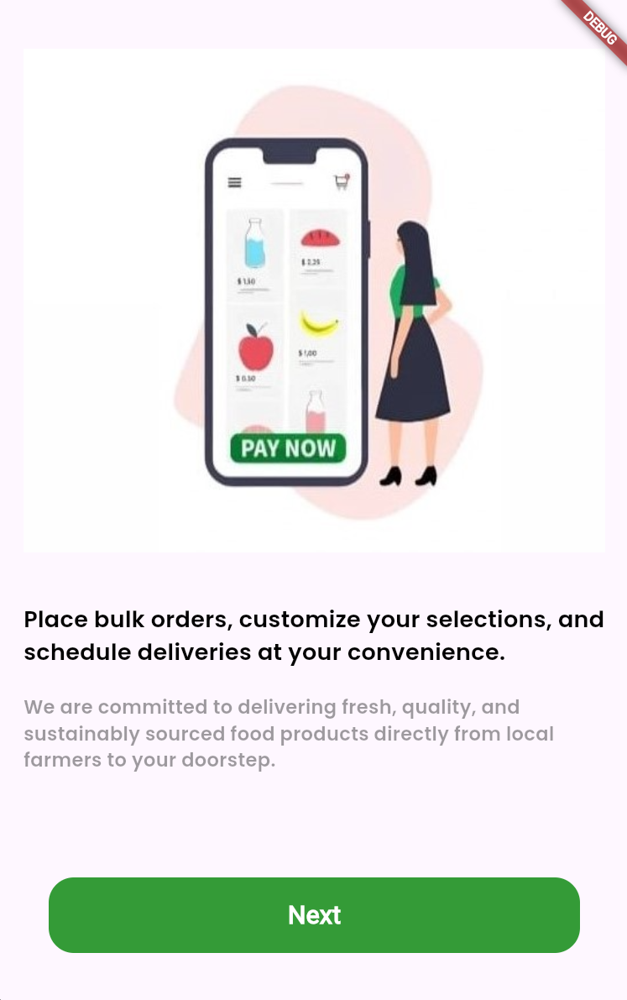
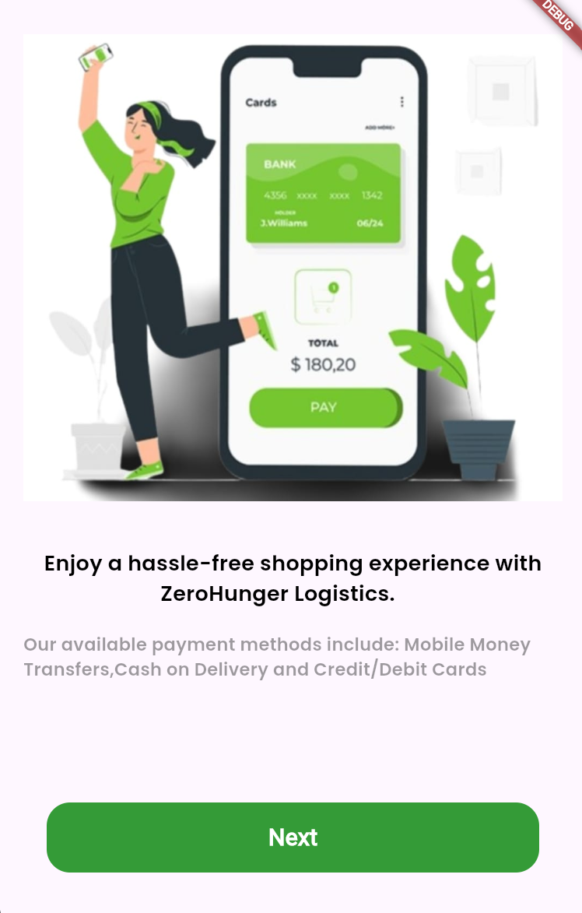
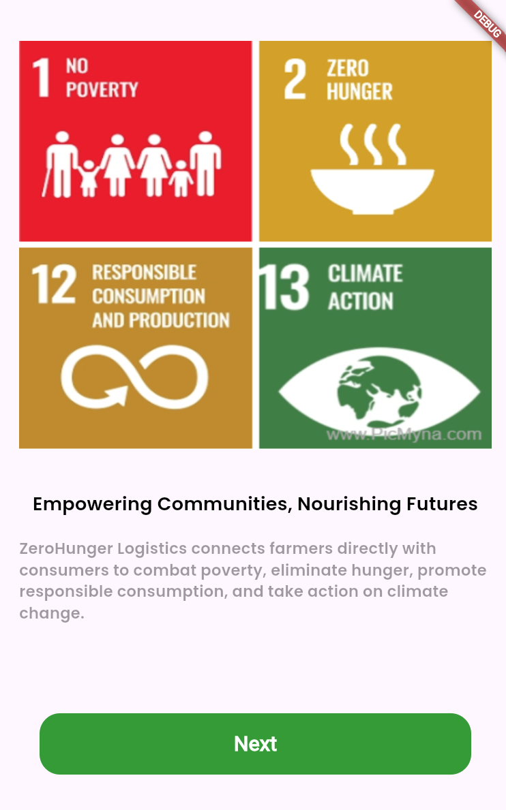
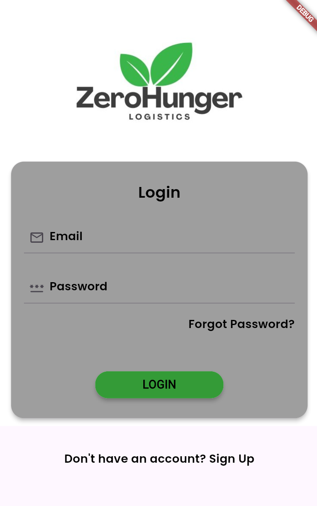
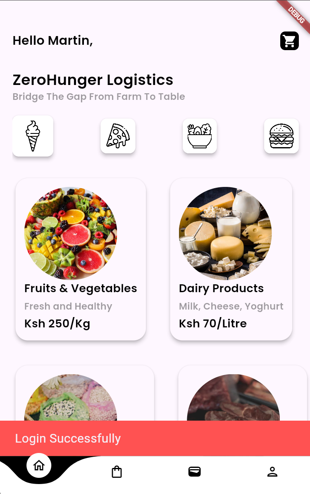
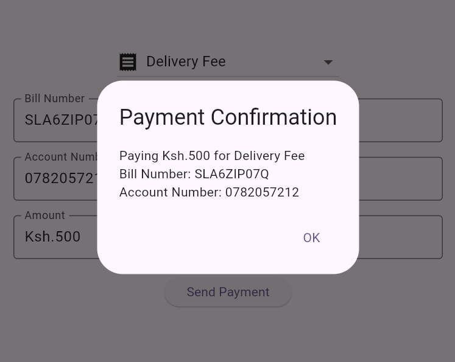
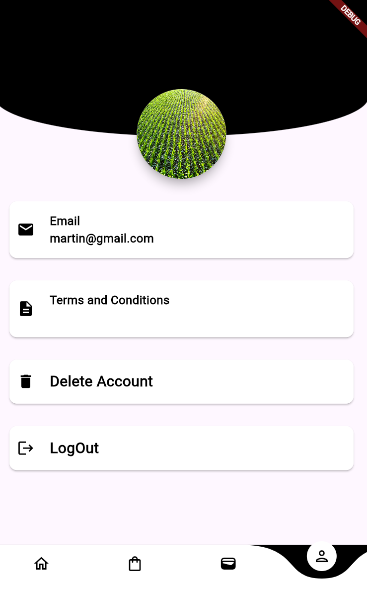

# zerohunger_logistics_app

ZeroHunger Logistics is a digital platform committed to bridging the gap from farm to table by connecting local farmers directly with consumers and traders. Our mission is to deliver fresh, quality, and sustainably sourced food products while promoting food security and reducing waste. The platform allows users to place bulk orders, customize selections, and schedule deliveries at their convenience.

## Features

- **Firebase Authentication:** Secure and simplify user registration and login with email/password, phone number, or third-party providers like Google.
- **Bulk Ordering:** Easily place bulk orders for groceries and other food products directly from local farmers.
- **Admin Section:** A dedicated admin panel that allows administrators to add, edit, or delete items available for bulk orders.
- **Profile Section:** The users are able to see their details on their profile and also they can edit to their specifications.
- **Flexible Payment Options:** Pay using Mobile Money Transfers, Cash on Delivery, or Credit/Debit Cards.
- **User-Friendly Interface:** Simple and easy-to-use app interface designed to enhance the user experience.
- **Paystack Payment Integration:** Make secure payments using major credit or debit cards, integrated with Paystack.

## Getting Started

Follow these instructions to set up the project on your local machine.

### Prerequisites

- [Flutter SDK](https://flutter.dev/docs/get-started/install) installed
- [Dart SDK](https://dart.dev/get-dart) installed
- [Android Studio](https://developer.android.com/studio) or [Visual Studio Code](https://code.visualstudio.com/) with Flutter and Dart plugins

### Installation

1. **Clone the Repository**

   ```bash
   git clone https://https://github.com/martinsigei/zeroHunger-Project
   cd zerohunger-logistics
Install Dependencies

Run the following command to get all the required dependencies:
```
flutter pub get
```
Run the Application

To start the application on an emulator or connected device:
```
flutter run
```
## Project Structure
<ul>
<li>lib/: Contains the main application code
<li>lib/pages/: Screens for onboarding, signup, and main functionality
<li>lib/widgets/: Reusable UI components
<li>lib/service/: Contains services for managing authentication and database operations, such as:Firebase Authentication setup and role-based access control.
<li>images/: Contains images and other static resources
<li>pubspec.yaml: Dependency and asset configuration<ul/>
   
## Contributing
Contributions are welcome! Please fork the repository and create a pull request with your changes. Ensure that your code follows the established coding standards and is properly documented.

## Onboarding Screens

Below are some of the previews of the ZeroHunger Logistics Application:

List<OnboardingContent> contents = [
  OnboardingContent(
    description: "Welcome to ZeroHunger Logistics!",
    image: 
    
    ,
  ),
  OnboardingContent(
    ,
    i
    
    ,
  ),
  OnboardingContent(
    ,
    image: 
    ,
  ),
  OnboardingContent(
    ,
    image: 
    ,
  ),
  OnboardingContent(
    ,
    image: 
    ,
  ),
  OnboardingContent(
    ",
    image: 
    ,
  ),
  OnboardingContent(
    ",
    image: 
    ,
  ),
];


## Bug Reports and Feature Requests
Please use the issue tracker to report any bugs or request new features.

## License
This project is licensed under the MIT License - see the LICENSE file for details.

## Contacts
Email:sigeimartin03@gmail.com

Thank you for supporting ZeroHunger Logistics and helping us work towards a world with Zero Hunger!

### Key Sections
- **Introduction:** Brief overview of ZeroHunger Logistics.
- **Features:** Highlighting key functionalities of the platform.
- **Getting Started:** Steps to set up and run the project.
- **Project Structure:** Overview of the main folders and files.
- **Onboarding Screens:** Explanation of the onboarding screens.
- **Contributing:** Guidelines on how to contribute to the project.
- **License:** Licensing information.
- **Contact:** Contact details for support or inquiries.

Feel free to modify or expand upon this template as needed!


