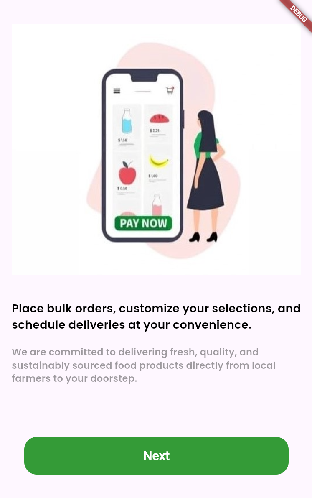
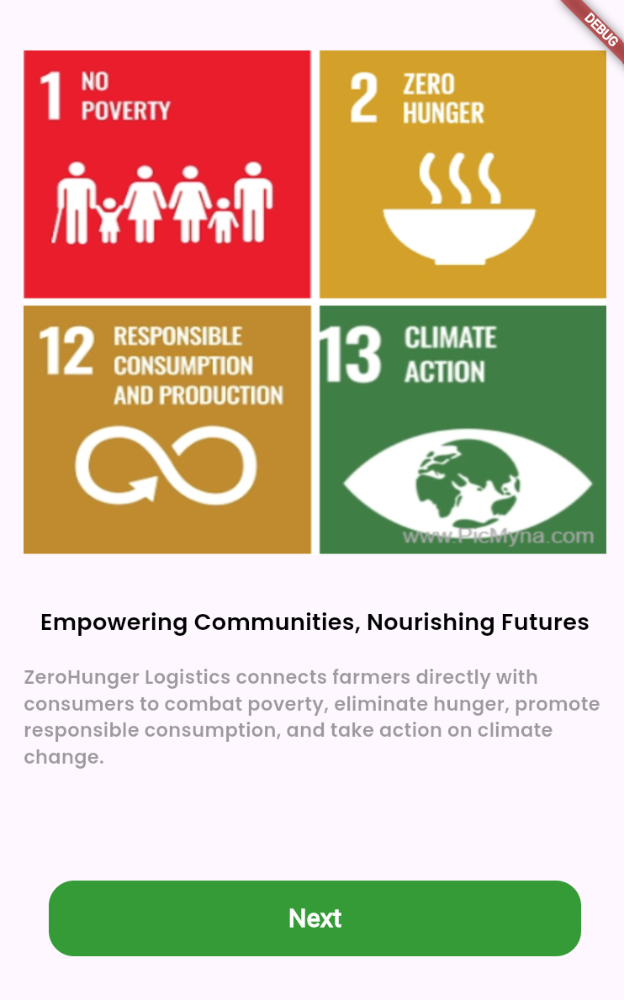
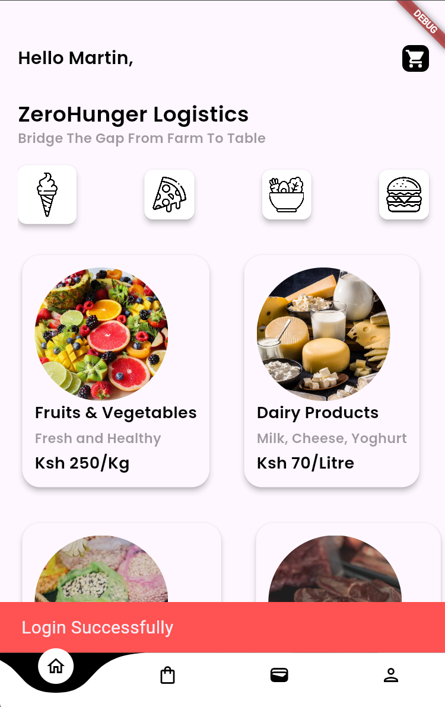

# zerohunger_logistics_app

ZeroHunger Logistics is a digital platform committed to bridging the gap from farm to table by connecting local farmers directly with consumers and traders. Our mission is to deliver fresh, quality, and sustainably sourced food products while promoting food security and reducing waste. The platform allows users to place bulk orders, customize selections, and schedule deliveries at their convenience.

## Features

- **Bulk Ordering:** Easily place bulk orders for groceries and other food products directly from local farmers.
- **Flexible Payment Options:** Pay using Mobile Money Transfers, Cash on Delivery, or Credit/Debit Cards.
- **Sustainable Practices:** Optimize transportation routes to reduce fuel consumption and minimize the carbon footprint of food deliveries.
- **Real-Time Order Management:** Manage orders in real-time, minimizing the risk of overproduction and unsold inventory.
- **Convenient Delivery Scheduling:** Schedule deliveries according to your needs and availability.

## Getting Started

Follow these instructions to set up the project on your local machine.

### Prerequisites

- [Flutter SDK](https://flutter.dev/docs/get-started/install) installed
- [Dart SDK](https://dart.dev/get-dart) installed
- [Android Studio](https://developer.android.com/studio) or [Visual Studio Code](https://code.visualstudio.com/) with Flutter and Dart plugins

### Installation

1. **Clone the Repository**

   ```bash
   git clone https://https://github.com/martinsigei/zeroHunger-Project
   cd zerohunger-logistics
Install Dependencies

Run the following command to get all the required dependencies:
```
flutter pub get
```
Run the Application

To start the application on an emulator or connected device:
```
flutter run
```
## Project Structure
<ul>
<li>lib/: Contains the main application code
<li>pages/: Screens for onboarding, signup, and main functionality
<li>widgets/: Reusable UI components
<li>models/: Data models for the app (e.g., OnboardingContent)
<li>assets/: Contains images and other static resources
<li>pubspec.yaml: Dependency and asset configuration<ul/>
   
## Onboarding Screens
The onboarding feature provides new users with a brief overview of the application’s benefits and features.

Content Model
Defined in lib/widgets/content_model.dart:

dart
Copy code
class OnboardingContent {
  String image;
  String title;
  String description;

  OnboardingContent({required this.description, required this.image, required this.title});
}

List<OnboardingContent> contents = [
  OnboardingContent(
      description: 
      ,
    
 
 ),

      
  OnboardingContent(
      description: 
      image: 

 ),

  OnboardingContent(
      description:
        image: 
 ),

   OnboardingContent(
      description: ,
   image: 
),

   OnboardingContent(
      description: ,
   image: 
   
),
    OnboardingContent(
      description: ,
   image: 
   
)
];

## Contributing
We welcome contributions! Please fork the repository and create a pull request with your changes. Ensure that your code follows the established coding standards and is properly documented.

## Bug Reports and Feature Requests
Please use the issue tracker to report any bugs or request new features.

## License
This project is licensed under the MIT License - see the LICENSE file for details.

Thank you for supporting ZeroHunger Logistics and helping us work towards a world with Zero Hunger!

### Key Sections
- **Introduction:** Brief overview of ZeroHunger Logistics.
- **Features:** Highlighting key functionalities of the platform.
- **Getting Started:** Steps to set up and run the project.
- **Project Structure:** Overview of the main folders and files.
- **Onboarding Screens:** Explanation of the onboarding feature with code snippets.
- **Contributing:** Guidelines on how to contribute to the project.
- **License:** Licensing information.
- **Contact:** Contact details for support or inquiries.

Feel free to modify or expand upon this template as needed!


